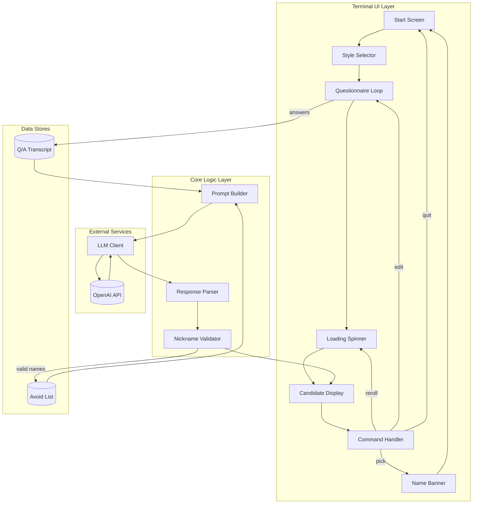
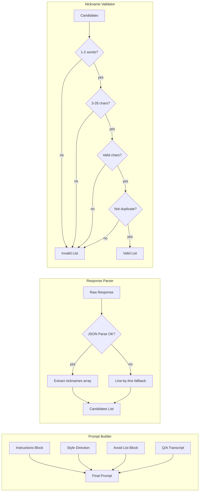
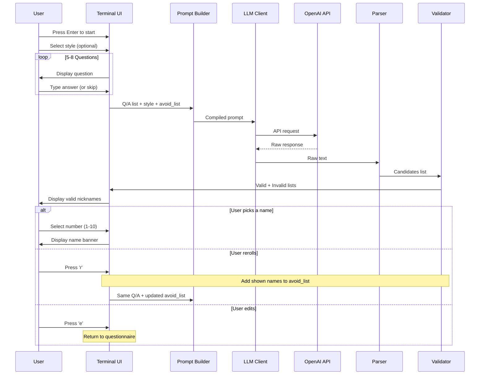
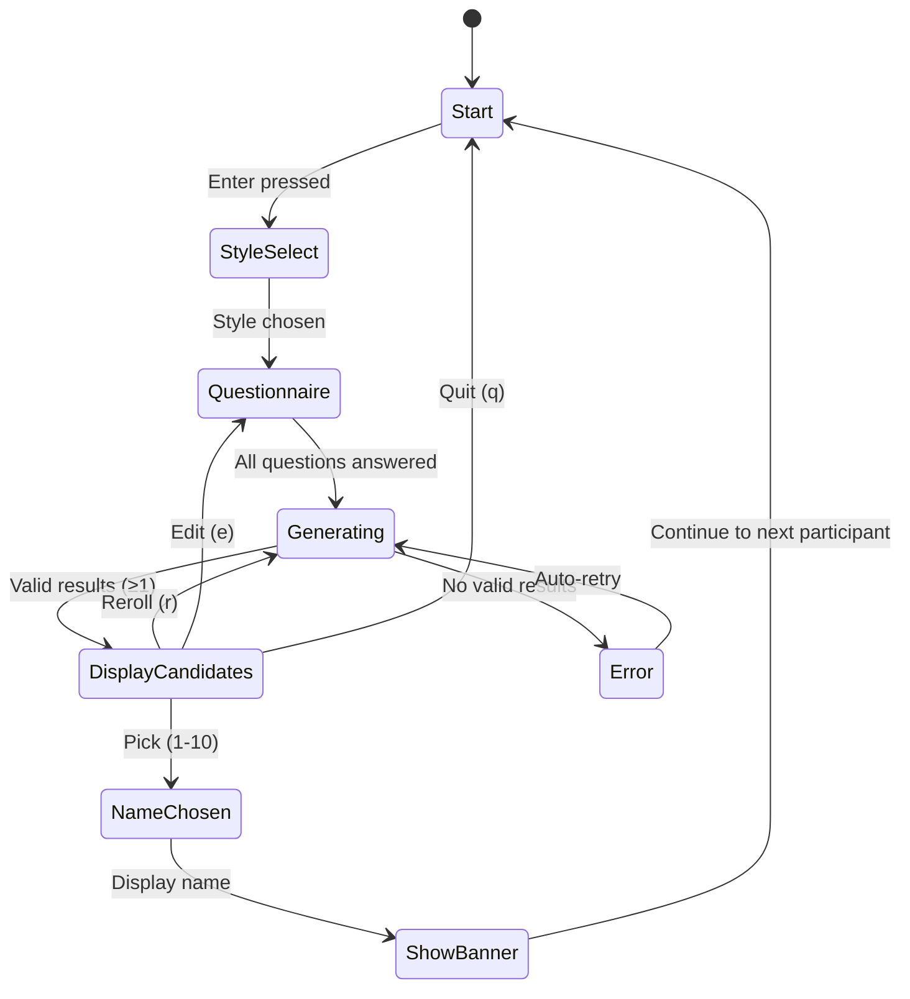

# Playa Nickname Booth — Architecture Diagram

## System Overview



## Component Detail



## Data Flow Sequence



## Module Structure

```
handlebar/
├── src/
│   ├── main.py              # Entry point
│   ├── ui/
│   │   ├── __init__.py
│   │   ├── terminal.py      # Terminal UI controller
│   │   ├── questionnaire.py # Question asking logic
│   │   ├── picker.py        # Candidate display & selection
│   │   └── banner.py        # ASCII name display
│   ├── core/
│   │   ├── __init__.py
│   │   ├── prompt.py        # Prompt builder
│   │   ├── parser.py        # Response parser
│   │   └── validator.py     # Nickname validation
│   ├── llm/
│   │   ├── __init__.py
│   │   └── client.py        # OpenAI SDK wrapper
│   └── data/
│       ├── __init__.py
│       ├── questions.py     # Question bank
│       └── styles.py        # Style mode definitions
├── config/
│   └── settings.py          # API keys, model config
├── docs/
│   └── ...
└── tests/
    └── ...
```

## State Machine

